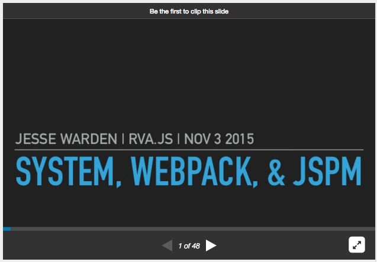

# Module Systems in JavaScript

My slidedeck for [SystemJS](https://github.com/systemjs/systemjs), [Webpack](https://webpack.github.io/), and [JSPM](http://jspm.io/) Overview presentation that I gave at the [RVA.js](http://rvajs.com/) Richmond, Virginia JavaScript user group.

You can also [see the slides online](http://www.slideshare.net/jesterxl/system-webpackjspm).

# Resources

- [RequireJS](http://requirejs.org/)
- [Browserify](https://github.com/substack/browserify-handbook)
- [Webpack](https://webpack.github.io/)
- [ES6 Module Loader](https://github.com/ModuleLoader/es6-module-loader)
- [SystemJS](https://github.com/systemjs/systemjs)
- [JSPM](http://jspm.io/)
- [ES6 Modules Chapter](http://exploringjs.com/es6/ch_modules.html)